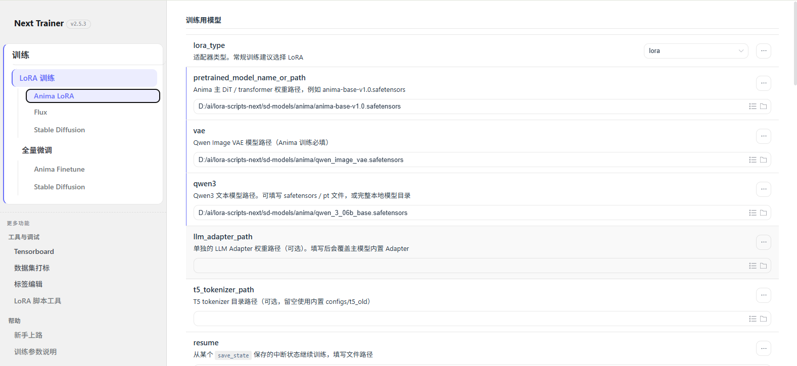
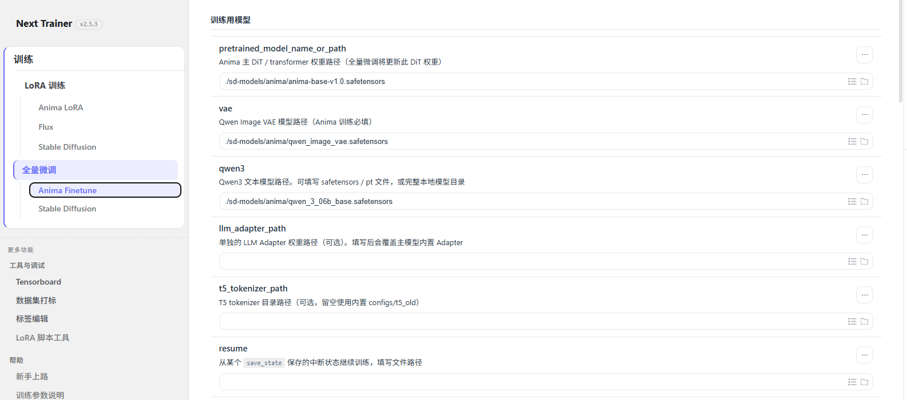

<p align="center">
  
</p>

<h1 align="center">Next Trainer</h1>

<p align="center">
  <b>Windows 一键 LoRA / 全量微调训练工具</b> — 支持 <b>Anima</b> / SD 1.5 / SDXL / Flux<br/>
  解压即用，无需配环境。Anima LoRA 约 12GB 显存即可起步；<b>Anima 全量微调建议 24GB 级显存</b>。<br/>
  <sub>基于 <a href="https://github.com/kohya-ss/sd-scripts">kohya-ss/sd-scripts</a>，秋叶系 GUI 体验。</sub>
</p>

<p align="center">
  <a href="https://github.com/wochenlong/lora-scripts-next/releases"></a>
</p>

<p align="center">
  <a href="https://github.com/wochenlong/lora-scripts-next"></a>
  <a href="https://github.com/wochenlong/lora-scripts-next/blob/main/LICENSE"></a>
</p>
<p align="center">
  <a href="https://github.com/wochenlong/lora-scripts-next/blob/main/README.md"><b>English (README)</b></a>
</p>
<p align="center">
  <a href="https://github.com/wochenlong/lora-scripts-next/blob/main/NOTICE.md"><b>致谢 & 许可</b></a>
</p>

---

<p align="center">
  
</p>

<p align="center"><sub>首页传送门 — 训练、监控与新手上路快捷入口</sub></p>

---

## 三步开始训练

```
1. 下载  →  从 Releases 下载 SD-Trainer-v2.5.2.7z（约 380 MB），解压
2. 启动  →  双击 run_gui.bat（首次自动安装依赖 ~3 GB）
3. 训练  →  浏览器打开 http://127.0.0.1:28000，选模型、填参数、开练
```

整合包已内置默认 WD 打标模型 **wd14-convnextv2-v2**（约 400 MB，位于 `huggingface/`），WebUI「打标」页开箱即用。

> **要求：** Windows 10/11，NVIDIA 显卡（RTX 20+），~7 GB 磁盘。

<details>
<summary><b>从源码安装（Linux / 高级用户）</b></summary>

```sh
git clone https://github.com/wochenlong/lora-scripts-next.git
cd lora-scripts-next

# Windows
run_gui.bat

# Linux
bash install.bash && bash run_gui.sh

# 可选：安装 Flash Attention 2 加速 Anima 训练
# Windows
install_flash_attn.bat
# Linux
bash install_flash_attn.sh
```

推荐 Python **3.10**。详见 [Flash Attention 2 文档](docs/flash-attention.md)。

</details>

---

## 支持什么

| 模式 | 模型 / 脚本 | 说明 |
|------|-------------|------|
| **Anima LoRA** | LoRA · LoKr · **T-LoRA** | Flash Attention 2 / xformers / SDPA · 约 12GB 显存起 |
| **Anima 全量微调** | 完整 DiT（`anima_train.py`） | 侧栏 **全量微调 → Anima Finetune** · **约 24GB 显存**（4090 档） |
| SD 1.5 / SDXL LoRA | LoRA · LoHa · LoKr | xformers / SDPA |
| SD 1.5 / SDXL 全量微调 | Dreambooth / SDXL finetune | 侧栏 **全量微调 → Stable Diffusion** |
| Flux | LoRA | xformers / SDPA |

<p align="center">
  
</p>

<p align="center"><sub>Anima LoRA — 侧栏导航、中栏模型与数据集表单、右栏配置预览</sub></p>

<p align="center">
  
</p>

<p align="center"><sub>Anima 全量微调 — 侧栏「全量微调 → Anima Finetune」，更新完整 DiT 权重</sub></p>

---

## 训练监控

训练启动后自动打开监控页（默认端口 6008，可自动回退），GPU 状态、训练参数、Loss 曲线、预览图、日志一站式查看。

<p align="center">
  
</p>

<p align="center"><sub>GPU 负载 & 显存、总步数、训练参数一目了然</sub></p>

<p align="center">
  
</p>

<p align="center"><sub>训练预览图 + TensorBoard 同源 Loss / LR 曲线</sub></p>

<p align="center">
  
</p>

<p align="center"><sub>实时训练日志，自动滚动</sub></p>

---

<details>
<summary><b>显存参考（Anima，1024 分辨率，RTX 4090 实测）</b></summary>

**Anima LoRA**

| 显存 | 配置 | 备注 |
|------|------|------|
| ≥ 24 GB | 默认参数 | 最省心 |
| ≥ 16 GB | `gradient_checkpointing` | 推荐日常 |
| ≥ 12 GB | 梯度检查点 | 稳定 |
| ≥ 10 GB | 梯度检查点 + `blocks_to_swap=16` | 速度略降 |
| ≥ 8 GB | 梯度检查点 + swap 24 + 缓存 TE + LoKr | 极限 |

**Anima 全量微调**（更新完整 DiT 权重 — 请用 WebUI **Anima Finetune**，不是 LoRA 页）

| 显存 | 配置 | 备注 |
|------|------|------|
| ≥ 24 GB | 默认 + latents/TE 缓存 | 实测专用显存约 **23–24 GB**；建议 4090 及以上 |

</details>

<details>
<summary><b>文档</b></summary>

| 主题 | 链接 |
|------|------|
| Anima LoRA 训练指南 | [docs/anima-training.md](docs/anima-training.md) |
| Anima 后端（LoRA + 全量微调） | [docs/anima-backend.md](docs/anima-backend.md) |
| Anima 全量微调示例 TOML | [docs/examples/anima-full-finetune.toml](docs/examples/anima-full-finetune.toml) |
| Flash Attention 2 | [docs/flash-attention.md](docs/flash-attention.md) |
| 训练监控 & SSE 接口 | [docs/train-monitor.md](docs/train-monitor.md) |
| Docker 部署 | [docs/docker.md](docs/docker.md) |
| CLI 参数 | [docs/cli-args.md](docs/cli-args.md) |

</details>

---

## 仓库目录说明

| 位置 | 用途 |
|------|------|
| 根目录 | 仅保留契约入口 + 薄转发器，详见 [docs/repo-layout.md](docs/repo-layout.md) |
| `scripts/portable/` | 整合包启动逻辑 |
| `scripts/autodl/` | 云 GPU 运维（根目录同名文件为转发） |
| `scripts/cli/` | 旧式命令行训练（Anima 请用 WebUI） |
| `legacy/` | 打标 / notebook 等，日常可忽略 |
| `doc/local/` | 本地交接与 Issue 草稿（不上传 GitHub） |
| `docs/` | 公开文档（含 AutoDL 部署等） |

---

## 常见问题

<details>
<summary><b>无法运行 run_gui.ps1 / 未数字签名</b></summary>

推荐直接双击 `run_gui.bat`。如果一定要运行 `.ps1`：

```powershell
powershell -ExecutionPolicy Bypass -File .\run_gui_source.ps1
```

</details>

<details>
<summary><b>解压后路径嵌套两层</b></summary>

若路径出现 `...\lora-scripts-next-2.5.0\lora-scripts-next-2.5.0\`，请进入内层含 `run_gui.bat` 的目录。

</details>

<details>
<summary><b>torch 安装失败 / No matching distribution</b></summary>

**源码安装**（`run_gui.bat` 首次自动装依赖、或手动 `install-cn.ps1`）常见原因：

1. **Python 版本不对** — 需要 **3.10 或 3.11、64 位**。3.12/3.13 没有对应 CUDA 预编译包，pip 会报「找不到匹配版本」。
2. **仓库太旧** — 若脚本里仍是 `torch 2.0.x + cu118`，请 `git pull` 到最新，或改用 [Releases](https://github.com/wochenlong/lora-scripts-next/releases) 整合包。
3. **半装坏的 venv** — 删掉项目下的 `venv` 文件夹后重装。

**不想折腾环境**：直接下载 **SD-Trainer-v2.x.7z** 整合包，解压双击 `run_gui.bat`（内置 Python，无需自装 torch）。

重装示例（PowerShell，在项目根目录）：

```powershell
Remove-Item -Recurse -Force venv -ErrorAction SilentlyContinue
py -3.10 -m venv venv
.\venv\Scripts\activate
powershell -ExecutionPolicy Bypass -File .\install-cn.ps1
```

</details>

<details>
<summary><b>打标模型放在哪 / 还要下载吗</b></summary>

- **默认模型**：`wd14-convnextv2-v2`（HuggingFace：`SmilingWolf/wd-v1-4-convnextv2-tagger-v2`，revision `v2.0`）
- **缓存路径**：项目根目录 `huggingface/hub/`（环境变量 `HF_HOME=huggingface`）
- **整合包**：发布 7z 已内置，一般无需再下
- **源码**：首次 `install-cn.ps1` 会预下载；之后每次 `run_gui.bat` 启动前若缺失会自动补下。手动：`python scripts/prefetch_default_tagger.py`

</details>

<details>
<summary><b>整合包：能开网页但无法开始训练（v2.5.2）</b></summary>

请升级到 **v2.5.3** 整合包，不要继续用 v2.5.2。说明与保留用户数据步骤见 [`docs/portable-upgrade-2.5.2-to-2.5.3.md`](docs/portable-upgrade-2.5.2-to-2.5.3.md)（[Issue #54](https://github.com/wochenlong/lora-scripts-next/issues/54)）。

</details>

<details>
<summary><b>整合包更新后打不开 / 启动脚本过时</b></summary>

整合包布局固定为：根目录 `run_gui.bat` + `python_embeded/` + `SD-Trainer/`。

- **用 `Update-SD-Trainer.bat` 拉代码后**：脚本会尝试刷新根目录 `run_gui.bat`；若仍失败，从新 Release 解压覆盖，或手动运行 `SD-Trainer\scripts\portable\sync_portable_root_launchers.bat`。
- **只解压过旧 7z、没有 `SD-Trainer\scripts\portable\`**：需下载新版 7z，或至少用新版替换整个 `SD-Trainer` 文件夹与根目录 `run_gui.bat`。
- 实际启动逻辑在 `SD-Trainer\scripts\portable\launch_portable.bat`，随项目更新，不要删改 `python_embeded` / `SD-Trainer` 文件夹名。

</details>

---

<details>
<summary><b>更新日志</b></summary>

| 日期 | 版本 |
|------|------|
| 2026-05-28 | **v2.6.0** — **Anima 全量微调** WebUI（`anima-finetune`）、`anima_train.py` 封装、全量微调导航、监控类型修正；约 24GB 显存参考 |
| 2026-05-27 | **v2.5.3** — 便携包依赖健康检查、侧栏版本号 ([#54](https://github.com/wochenlong/lora-scripts-next/issues/54)) |
| 2026-05-21 | **v2.5.0** — UI 焕新：侧栏导航重构、首页传送门、训练监控仪表盘新增 GPU 指标；CSS 去重清理 |
| 2026-05-21 | **v2.4.0** — 训练稳定性：环境隔离、NaN 过滤、采样保护、attn_mode 降级、路径规范化；整合包 tkinter 修复 |
| 2026-05-20 | **v2.3.0** — 训练监控升级：TensorBoard 同源曲线、参数速查、日志同步 |
| 2026-05-19 | **v2.2.0** — 整合包 flash-attn 治本、闪退日志、跨盘监控 |
| 2026-05-19 | **v2.1.0** — Flash Attention 2 预编译 wheel、按步数保存 |
| 2026-05-18 | **v2.0.0** — 整合包首发、AMD 检测、bf16 修复 |

详见 [CHANGELOG.md](CHANGELOG.md)。

</details>

<details>
<summary><b>致谢</b></summary>

[Akegarasu/lora-scripts](https://github.com/Akegarasu/lora-scripts) · [kohya-ss/sd-scripts](https://github.com/kohya-ss/sd-scripts) · [LyCORIS](https://github.com/KohakuBlueleaf/LyCORIS) · [T-LoRA](https://github.com/ControlGenAI/T-LoRA) — 完整归属见 [NOTICE.md](NOTICE.md)

</details>

---

<p align="center"><sub>维护者：<b><a href="https://github.com/wochenlong">@wochenlong</a></b> · <a href="CONTRIBUTORS.md">贡献者</a></sub></p>
