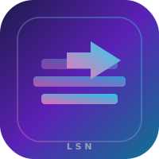
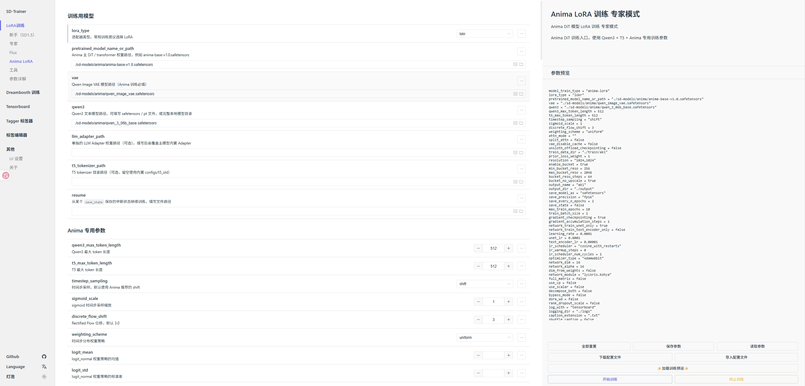

<p align="center">
  
</p>

<h1 align="center">lora-scripts-next</h1>

<p align="center">
  <strong>SD-Trainer</strong> — LoRA · Dreambooth · 围绕 <a href="https://github.com/kohya-ss/sd-scripts">kohya-ss/sd-scripts</a> 的一站式训练封装<br/>
  <sub><em>个人维护分支：在熟悉的秋叶系体验上，把 Anima、RF 和自用工作流接到一起。</em></sub>
</p>

<p align="center">
  <a href="https://github.com/wochenlong/lora-scripts-next"></a>
  <a href="https://github.com/wochenlong/lora-scripts-next"></a>
  <a href="https://github.com/wochenlong/lora-scripts-next/blob/main/LICENSE"></a>
  <a href="https://github.com/wochenlong/lora-scripts-next/releases"></a>
</p>

<p align="center">
  <a href="https://github.com/wochenlong/lora-scripts-next/releases"><b>下载发布</b></a>
  &nbsp;·&nbsp;
  <a href="https://github.com/wochenlong/lora-scripts-next/blob/main/README.md"><b>English README</b></a>
  &nbsp;·&nbsp;
  <a href="https://github.com/wochenlong/lora-scripts-next/blob/main/NOTICE.md"><b>NOTICE</b></a>
</p>

---

<p align="center">
  <sub>维护者：<b>@wochenlong</b> — 本仓库用于个人迭代；README 头图与界面截图为 <code>assets/readme/</code> 下随仓资源。</sub>
</p>

<br/>

## 一览

| | |
|:---|:---|
| **训练 WebUI** | 预设、TensorBoard、WD 标签器、标签编辑器同一入口；运行 `run_gui.ps1` / `run_gui.sh` 后打开 **`http://127.0.0.1:28000`**。 |
| **本 fork 增量** | 左侧 sidebar 多出 **Anima LoRA**（Anima DiT + Qwen3 + T5）训练入口；训练日志通过 SSE 实时推送到独立页面 **`/train-log`**；新增 `MIKAZUKI_FRONTEND_DIST` 环境变量，无需动 submodule 即可换前端 dist 目录。 |
| **后端** | [kohya-ss/sd-scripts](https://github.com/kohya-ss/sd-scripts) 是主要训练后端，并负责 Anima 训练；SDXL RF 脉络来自 [bluvoll/Akegarasu-lora-scripts-RF](https://github.com/bluvoll/Akegarasu-lora-scripts-RF)。 |
| **许可证与致谢** | 详见 [`NOTICE.md`](NOTICE.md)。 |

---

## 界面预览

<p align="center">
  
</p>

<p align="center"><sub>同一 WebUI 内可切到 TensorBoard、WD 1.4 标签器、标签编辑器等工具.</sub></p>

---

<details>
<summary><b>上游与血缘（展开）</b></summary>

当前仓库：**[wochenlong/lora-scripts-next](https://github.com/wochenlong/lora-scripts-next)**。界面与打包体验源自 **秋叶一键训练包 / [Akegarasu/lora-scripts](https://github.com/Akegarasu/lora-scripts)**，训练后端为 **[kohya-ss/sd-scripts](https://github.com/kohya-ss/sd-scripts)**。SDXL **Rectified Flow** 参考 **[bluvoll/Akegarasu-lora-scripts-RF](https://github.com/bluvoll/Akegarasu-lora-scripts-RF)**。**Anima** 曾参考 **[WhitecrowAurora/lora-rescripts](https://github.com/WhitecrowAurora/lora-rescripts)**（**SD-reScripts**），但当前维护基线已经迁移到 **kohya-ss/sd-scripts**。

</details>

---

# 使用方法

### 必要依赖

Python **3.10** 与 **Git**。

### 克隆（含子模块）

> ⚠️ **Anima / SD3 LoRA 训练必需。** 训练引擎位于 `vendor/sd-scripts` 子模块，普通 `git clone` 不会拉取，会导致一启动训练就报错退出。

```sh
git clone --recurse-submodules https://github.com/wochenlong/lora-scripts-next.git
cd lora-scripts-next
```

忘了加 `--recurse-submodules`，或者直接下载了 ZIP？在仓库根目录执行一次：

```sh
git submodule update --init --recursive
```

`install.ps1` / `install.bash` 以及 GUI 启动时也会自动尝试拉取子模块；如需关闭可设置环境变量 `ANIMA_SKIP_AUTO_INIT=1`。

## SD-Trainer GUI

### Windows

**安装：** 运行 `install-cn.ps1`（或 `install.ps1`）。  
**训练：** 运行 `run_gui.ps1`，浏览器打开 **[http://127.0.0.1:28000](http://127.0.0.1:28000)**。

### Linux

**安装：** `install.bash`  
**训练：** `bash run_gui.sh`，同上地址。

### Anima LoRA 训练

启动 WebUI 后，左侧 sidebar 里点 **Anima LoRA** 进入（占用了原来 SD3 的位置——`model_train_type` 已经被改成 `anima-lora`，后端会调度到 [`scripts/dev/anima_train_network.py`](scripts/dev/anima_train_network.py)）。表单里需要填 4 个模型路径：

本地入口是兼容 wrapper：它会适配 GUI 生成的 TOML，并把真正的 Anima 训练委托给 [`config/anima_backend.toml`](config/anima_backend.toml) 中固定的 `kohya-ss/sd-scripts` 后端。维护说明见 [`docs/anima-backend.md`](docs/anima-backend.md)。

| 字段 | 含义 |
|---|---|
| `pretrained_model_name_or_path` | Anima DiT 主权重，如 `./sd-models/anima-preview.safetensors` |
| `vae` | Qwen Image VAE 模型路径（必填） |
| `qwen3` | Qwen3 文本模型，可填 `.safetensors` / `.pt` 文件，或完整本地模型目录 |
| `t5` | T5 文本编码器权重 |

打开表单里的 **`enable_preview`** 开关后，采样会切到 Anima 推荐参数（1024×1024、CFG 4.5、40 步、seed 42，并自动填入 Anima 风格的正反向提示词）。Windows 用户也可以直接运行 [`run_gui_anima.bat`](run_gui_anima.bat)，会以 Anima 默认值启动 WebUI。

> 提示：该页面 URL 仍是 `/lora/sd3.html`（SPA 路由复用了原槽位）。可见的标签、参数集合、底层训练脚本都是 Anima，**只有 URL 路径还是历史名字**。

### 训练日志（SSE）

WebUI 启动训练时，后端会捕获子进程 stdout 并按行通过 Server-Sent Events 转发，有两种用法：

- **独立全屏查看器** —— 浏览器打开 `http://127.0.0.1:28000/train-log?task_id=<task_id>`，或用 `<iframe src="/train-log?task_id=…" />` 嵌进自己的页面。背后是 [`mikazuki/static/train_log.html`](mikazuki/static/train_log.html)。
- **原始流** —— `GET /api/train/log/stream/{task_id}` 直接返回 `text/event-stream`，适合 Agent / 仪表板 / AutoDL 等远端 GPU 监控。

`task_id` 来自 `POST /api/run` 的返回值，浏览器也会缓存到 `localStorage` 里，方便查看器自动续上。

### 前端静态文件

训练 GUI 后端默认加载 `frontend/dist`。该目录是 `hanamizuki-ai/lora-gui-dist` 这个**只有编译产物的 submodule**，并不是前端源码——本仓库内没有 `package.json` 也没有前端构建步骤。你看到的 "Anima LoRA" 页面**并不在 dist 里**，而是由 `mikazuki/schema/sd3-lora.ts` 渲染出来的：本 fork 把这份 schema 整个改写成了 Anima 配置，后端把它喂给原版 UI，表单就跟着重新渲染了。

如果想接入自己另外打包的前端 dist，把 `MIKAZUKI_FRONTEND_DIST` 指向那个目录即可，无需动 submodule：

```bash
MIKAZUKI_FRONTEND_DIST=/path/to/your/dist python gui.py --listen
```

也可以把 `frontend` submodule 的 URL 改到自己的 dist 仓库。后端不会自动从前端源码构建 UI。

### Docker

#### 编译镜像

```bash
docker build -t lora-scripts-next:latest -f Dockerfile-for-Mainland-China .
```

#### 使用镜像（示例）

```bash
docker run --gpus all -p 28000:28000 -p 6006:6006 registry.cn-hangzhou.aliyuncs.com/go-to-mirror/akegarasu_lora-scripts:latest
```

亦可配合仓库内 `docker-compose.yaml`。镜像体积较大，拉取请耐心等待。GPU 与驱动问题请自行查阅文档。

## 通过脚本的传统训练方式

### Windows

运行 `install.ps1` 安装依赖后，编辑并运行 `train.ps1`。

### Linux

先激活虚拟环境：

```sh
source venv/bin/activate
```

编辑 `train.sh` 并运行。

### TensorBoard

`tensorboard.ps1` → [http://localhost:6006/](http://localhost:6006/)

### Anima 单角色 LoRA：训练步数参考（经验值）

在同一套数据与分辨率下对比 checkpoint 时，**约 1000～3000 次优化步**（`total optimization steps` 含义下的 step）往往已能呈现可用的角色外观；再往后更多是在细节与稳定性上微调。实际所需步数随**素材量与质量、repeat、bucket、网络维度、学习率与主观「够不够好」**变化很大，请以验证图为准。

训练启动日志中的 **`num batches per epoch`** × **目标 epoch** ≈ 到该 epoch 结束时的累计步数；例如每 epoch 510 batch、第 2 个 epoch 结束约 **1020** 步。

## 程序参数

| 参数名称 | 类型 | 默认值 | 描述 |
|----------|------|--------|------|
| `--host` | str | `127.0.0.1` | 服务器主机名 |
| `--port` | int | `28000` | 服务端口 |
| `--listen` | bool | `false` | 监听所有网卡 |
| `--skip-prepare-environment` | bool | `false` | 跳过环境准备 |
| `--disable-tensorboard` | bool | `false` | 禁用 TensorBoard |
| `--disable-tageditor` | bool | `false` | 禁用标签编辑器 |
| `--tensorboard-host` | str | `127.0.0.1` | TensorBoard 主机 |
| `--tensorboard-port` | int | `6006` | TensorBoard 端口 |
| `--localization` | str | | 界面语言 |
| `--dev` | bool | `false` | 开发者模式 |
