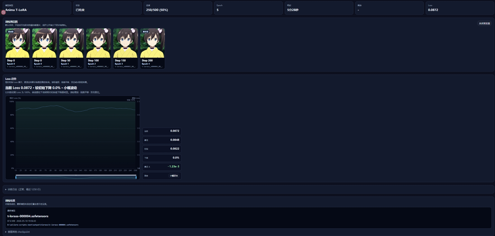

<p align="center">
  
</p>

<h1 align="center">lora-scripts-next</h1>

<p align="center">
  <strong>SD-Trainer</strong> — LoRA 一键训练 GUI，支持 SD / SDXL / Flux / <b>Anima</b><br/>
  <sub>基于 <a href="https://github.com/kohya-ss/sd-scripts">kohya-ss/sd-scripts</a> 后端，秋叶系界面体验。</sub>
</p>

<p align="center">
  <a href="https://github.com/wochenlong/lora-scripts-next"></a>
  <a href="https://github.com/wochenlong/lora-scripts-next"></a>
  <a href="https://github.com/wochenlong/lora-scripts-next/blob/main/LICENSE"></a>
  <a href="https://github.com/wochenlong/lora-scripts-next/releases"></a>
</p>

<p align="center">
  <a href="https://github.com/wochenlong/lora-scripts-next/releases"><b>下载整合包</b></a>
  &nbsp;·&nbsp;
  <a href="https://github.com/wochenlong/lora-scripts-next/blob/main/README.md"><b>English</b></a>
  &nbsp;·&nbsp;
  <a href="https://github.com/wochenlong/lora-scripts-next/blob/main/NOTICE.md"><b>致谢 & 许可</b></a>
</p>

---

## 快速开始

### Windows 整合包（推荐小白用户）

从 [Releases](https://github.com/wochenlong/lora-scripts-next/releases) 下载 **`SD-Trainer-v2.0.0.7z`**（~15 MB），解压后双击 `run_gui.bat` 即可启动。

首次启动会自动安装 PyTorch + CUDA + 所有依赖（~3 GB 下载），国内用户自动走阿里云/清华镜像加速。

| 文件 | 用途 |
|------|------|
| `run_gui.bat` | 启动训练 GUI（http://127.0.0.1:28000） |
| `Update-SD-Trainer.bat` | 从 GitHub 拉取最新代码 |
| `Download-Anima-Model.bat` | 从 ModelScope 下载 Anima 基础模型 |

> **系统要求：** Windows 10/11 64 位，NVIDIA 显卡（RTX 20 系列以上），~7 GB 硬盘空间。

### 从源码安装

```sh
git clone https://github.com/wochenlong/lora-scripts-next.git
cd lora-scripts-next
```

| 系统 | 操作 |
|------|------|
| Windows | 双击 **`run_gui.bat`**（首次自动安装依赖，之后直接启动） |
| Linux | `bash install.bash && bash run_gui.sh` |

启动后浏览器自动打开 **http://127.0.0.1:28000**。

> **Python 版本：** 推荐 **3.10**（所有依赖完美兼容）。3.11–3.12 基本可用，3.13+ 不支持。

#### 指定浏览器

默认使用系统浏览器。可通过 `--browser` 参数指定：

```sh
python gui.py --browser chrome
python gui.py --browser edge
```

#### Flash Attention 2（已有环境的用户）

新安装会自动包含 Flash Attention 2。如果你已有环境，手动安装一次即可加速 Anima 训练：

```sh
pip install flash-attn --no-build-isolation
```

---

## 功能亮点

- **多模型支持** — SD 1.5 / SDXL / Flux / **Anima** 全部开箱即用
- **Anima LoRA 训练** — 侧边栏一键进入，支持 LoRA / LoKr（LyCORIS）/ **T-LoRA**
- **Flash Attention 2 训练加速** — 自动检测并启用最优 Attention 后端（优先 Flash Attention 2，其次 xformers，最后 PyTorch SDPA）。整合包首次安装时自动安装 `flash-attn`
- **T-LoRA** — 基于扩散时间步的动态 Rank LoRA，正交初始化，防止过拟合（[论文](https://github.com/ControlGenAI/T-LoRA)）
- **训练监控页** — 随 GUI 自动启动，ECharts 交互式 Loss 图表（滚轮缩放 / 拖拽平移 / 一键复位），实时进度和预览图
- **TensorBoard 内置** — 侧边栏直接查看，无需额外操作
- **显卡检测** — 首次安装自动检测 NVIDIA / AMD 显卡，AMD 用户会收到友好提示及 ROCm 方案指引
- **AutoDL 适配** — 提供专用启动脚本 `start_autodl.sh`

---

## 界面预览

<p align="center">
  
</p>

<p align="center">
  
</p>

<p align="center"><sub>上：训练 GUI 主界面 &nbsp;|&nbsp; 下：训练监控页（端口 6008，自动打开）</sub></p>

---

## 详细文档

| 主题 | 链接 |
|------|------|
| Anima LoRA 训练指南 | [docs/anima-training.md](docs/anima-training.md) |
| 训练监控 & SSE 接口 | [docs/train-monitor.md](docs/train-monitor.md) |
| 前端定制 | [docs/frontend-customization.md](docs/frontend-customization.md) |
| Docker 部署 | [docs/docker.md](docs/docker.md) |
| 程序参数一览 | [docs/cli-args.md](docs/cli-args.md) |

---

<details>
<summary><b>更新日志</b></summary>

| 日期 | 内容 |
|------|------|
| 2026-05-19 | **v2.0.0** — 整合包发布、Flash Attention 2 自动加速、AMD 显卡检测、自动修复 bf16/fp16 精度问题、移除子模块改为直接包含 sd-scripts、启动时自动检查更新 |
| 2026-05-18 | T-LoRA 训练支持、交互式 Loss 图表、LoKr 标准化、Windows 便携包、AutoDL 脚本 |
| 2026-05-17 | Anima 训练后端完全迁移至 kohya-ss/sd-scripts |
| 2026-05-06 | 训练监控页重构：实时 Loss 卡片 + 粘性滚动 |

</details>

<details>
<summary><b>致谢 & 上游</b></summary>

| 项目 | 角色 |
|------|------|
| [Akegarasu/lora-scripts](https://github.com/Akegarasu/lora-scripts) | GUI 框架与一键训练体验（"秋叶式"） |
| [kohya-ss/sd-scripts](https://github.com/kohya-ss/sd-scripts) | 核心训练后端 |
| [KohakuBlueleaf/LyCORIS](https://github.com/KohakuBlueleaf/LyCORIS) | LoKr / LoHa 网络模块（Apache-2.0） |
| [ControlGenAI/T-LoRA](https://github.com/ControlGenAI/T-LoRA) | 时间步动态 LoRA（MIT, AIRI） |
| [bluvoll/Akegarasu-lora-scripts-RF](https://github.com/bluvoll/Akegarasu-lora-scripts-RF) | SDXL Rectified Flow 参考 |

完整归属见 [`NOTICE.md`](NOTICE.md)。

</details>

---

<p align="center"><sub>维护者：<b>@wochenlong</b></sub></p>
