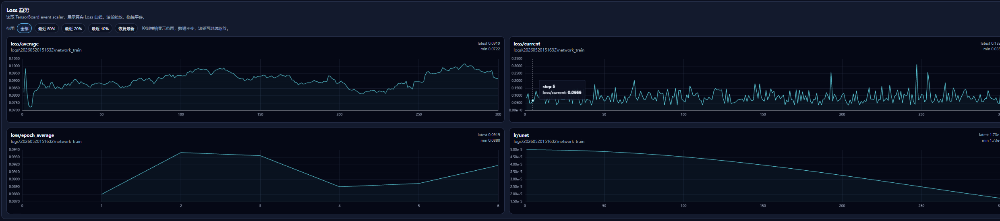

<p align="center">
  
</p>

<h1 align="center">lora-scripts-next</h1>

<p align="center">
  <strong>SD-Trainer</strong> — One-click LoRA training GUI for SD / SDXL / Flux / <b>Anima</b><br/>
  <sub>Powered by <a href="https://github.com/kohya-ss/sd-scripts">kohya-ss/sd-scripts</a>, with the familiar Akegarasu GUI experience.</sub>
</p>

<p align="center">
  <a href="https://github.com/wochenlong/lora-scripts-next"></a>
  <a href="https://github.com/wochenlong/lora-scripts-next"></a>
  <a href="https://github.com/wochenlong/lora-scripts-next/blob/main/LICENSE"></a>
  <a href="https://github.com/wochenlong/lora-scripts-next/releases"></a>
</p>

<p align="center">
  <a href="https://github.com/wochenlong/lora-scripts-next/releases"><b>Download</b></a>
  &nbsp;·&nbsp;
  <a href="https://github.com/wochenlong/lora-scripts-next/blob/main/README-zh.md"><b>中文文档</b></a>
  &nbsp;·&nbsp;
  <a href="https://github.com/wochenlong/lora-scripts-next/blob/main/NOTICE.md"><b>Credits & License</b></a>
</p>

---

## Quick Start

### Windows Portable Package (recommended for beginners)

Download **`SD-Trainer-v2.3.0.7z`** (~55 MB, includes embedded Python) from [Releases](https://github.com/wochenlong/lora-scripts-next/releases), extract, and double-click `run_gui.bat`.

First launch auto-installs PyTorch + CUDA + all dependencies (~3 GB download). Chinese users get mirror acceleration automatically.

| File | Purpose |
|------|---------|
| `run_gui.bat` | Launch training GUI (http://127.0.0.1:28000) |
| `Update-SD-Trainer.bat` | Pull latest code from GitHub |
| `Download-Anima-Model.bat` | Download Anima base model from ModelScope |

> **Requirements:** Windows 10/11 64-bit, NVIDIA GPU (RTX 20+), ~7 GB disk space.

#### Anima LoRA VRAM Reference (1024 resolution, benchmarked)

Measured on RTX 4090, batch=1, bf16, standard LoRA (dim=16):

| VRAM | Configuration | Notes |
|------|---------------|-------|
| **≥ 24 GB** | Default settings, 1024 resolution, no extra options needed | Easiest |
| **≥ 16 GB** | Enable `gradient_checkpointing` | Recommended for daily use |
| **≥ 12 GB** | Gradient checkpointing, peaks ~12.3 GB | Stable |
| **≥ 10 GB** | Gradient checkpointing + `blocks_to_swap = 16` | Stable, slightly slower |
| **≥ 8 GB** | Gradient checkpointing + `blocks_to_swap = 24` + `cache_text_encoder_outputs` + LoKr network | Runs, but tight — occasional OOM possible |

> 512 resolution saves roughly 2–3 GB; lowering `network_dim` (e.g. to 8) also helps marginally.

#### Portable package: Flash Attention 2 not supported (for now)

The **Windows portable package** (`SD-Trainer-v*.7z`) **does not install Flash Attention 2**; training uses **xformers** or **PyTorch SDPA**. This is intentional, not a failed install.

| Point | Why |
|-------|-----|
| **flash-attn needs triton** | Prebuilt `flash-attn` wheels install, but many kernels still run via **Triton** (`flash_attn.ops.triton`). |
| **Embedded Python + triton** | The portable bundle uses Python Embeddable (`python_embeded\`) without a full toolchain; `triton` / `triton-windows` often fail at JIT compile time. |
| **Cannot keep flash-attn without triton** | Flash-attn-only installs hit `No module named 'triton'`; `transformers` may still probe `flash_attn` if the package is present. |
| **What we do** | Skip flash-attn on first setup; on launch, remove broken flash-attn/triton pairs and set `TRANSFORMERS_ATTN_IMPLEMENTATION=sdpa`. |

For Flash Attention 2, use **[install from source](#install-from-source)** and follow **[Flash Attention 2 (source / venv)](#flash-attention-2-source--venv-installs)**. Portable flash-attn support may come later when embed Python + triton is reliable.

### Install from Source

```sh
git clone https://github.com/wochenlong/lora-scripts-next.git
cd lora-scripts-next
```

| OS | Action |
|----|--------|
| Windows | Double-click **`run_gui.bat`** (auto-installs on first run, then launches) |
| Linux | `bash install.bash && bash run_gui.sh` |

The browser auto-opens **http://127.0.0.1:28000** on launch.

> **Python version:** 3.10 recommended (full compatibility). 3.11–3.12 mostly works. 3.13+ is not supported.

#### Choose Browser

By default the system default browser opens. Use `--browser` to pick one:

```sh
python gui.py --browser chrome
python gui.py --browser edge
```

#### Flash Attention 2 (source / venv installs)

**Portable users:** see the section above — do not `pip install flash-attn` into `python_embeded`.

This section is for **`git clone` + `venv`** (or a full Python under `python\`), with **PyTorch 2.7.0 + CUDA 12.8** installed.

##### What it accelerates

| Training | Flash Attention 2 |
|----------|---------------------|
| **Anima / SD3 LoRA** | When the stack self-checks OK, the GUI sets `attn_mode` to `flash` (log: `Anima attn_mode auto-detected: flash`) |
| **SD 1.5 / SDXL / Flux, etc.** | Uses **xformers** from `requirements.txt`; does not require the flash-attn wheel |

Priority for Anima: `flash` → `xformers` → `torch` (PyTorch SDPA).

##### Requirements

- **Python 3.10** recommended (3.11–3.12 if a matching prebuilt wheel exists)
- **64-bit venv** — not the portable `python_embeded`
- **Matching PyTorch:** `torch==2.7.0+cu128`, `torchvision==0.22.0+cu128`
- **Windows:** install both **`triton-windows`** and **`flash-attn`** (flash-attn imports Triton kernels at runtime)

##### Option 1: Automatic (recommended)

1. Clone the repo and run **`run_gui.bat`** on first launch (`install-cn.ps1` or `install.ps1` creates venv, deps, and tries the flash-attn wheel).
2. On every launch, `run_gui.ps1` checks `triton` + `flash_attn`; if missing, it installs `triton-windows` then the prebuilt wheel (failure is non-fatal — falls back to xformers / SDPA).

China mirror first-time install:

```powershell
powershell -ExecutionPolicy Bypass -File .\install-cn.ps1
```

International:

```powershell
powershell -ExecutionPolicy Bypass -File .\install.ps1
```

##### Option 2: Manual install (Windows)

Inside an **activated venv**:

```powershell
.\venv\Scripts\activate

# 1. PyTorch (if not already installed)
pip install torch==2.7.0+cu128 torchvision==0.22.0+cu128 --index-url https://download.pytorch.org/whl/cu128

# 2. Triton (required on Windows, before flash-attn)
pip install "triton-windows<3.4"

# 3. Flash Attention 2 prebuilt wheel (Python 3.10 example)
pip install https://huggingface.co/lldacing/flash-attention-windows-wheel/resolve/main/flash_attn-2.7.4.post1%2Bcu128torch2.7.0cxx11abiFALSE-cp310-cp310-win_amd64.whl
```

Use `cp311` / `cp312` in the wheel filename if that is your Python version.

##### Option 3: Linux / WSL / AutoDL

```bash
bash install.bash    # venv + torch/xformers/requirements + optional flash-attn build
bash run_gui.sh
```

Building flash-attn from source needs a CUDA toolkit and C++ compiler; on failure, xformers / SDPA is used.

##### Verify installation

```bash
python -c "import triton; import flash_attn; from flash_attn.ops.triton.rotary import apply_rotary; print('Flash Attention 2 OK')"
```

Then run `python gui.py` and start **Anima LoRA** training — logs should show `attn_mode` `flash`.

##### Troubleshooting

| Symptom | Fix |
|---------|-----|
| `No module named 'triton'` | Install `triton-windows<3.4` on Windows, then the flash-attn wheel |
| Wheel installs but training uses xformers | Run the verify command above; flash-attn without working triton is ignored |
| Long compile or build errors | On Windows use the **prebuilt wheel** URLs, not `pip install flash-attn` from source |
| PyTorch not 2.7+cu128 | Align torch with `install.ps1` before installing flash-attn |
| Installed into portable `python_embeded` | **Unsupported** — use source + venv instead |

---

## Features

- **Multi-model** — SD 1.5 / SDXL / Flux / **Anima** all work out of the box
- **Anima LoRA training** — One-click sidebar entry, supports LoRA / LoKr (LyCORIS) / **T-LoRA**
- **Attention backends** — Source/venv: Flash Attention 2 when available (Windows prebuilt wheels). **Portable package:** xformers / PyTorch SDPA only ([flash-attn not supported yet](#portable-package-flash-attention-2-not-supported-for-now))
- **T-LoRA** — Timestep-Dependent LoRA with dynamic rank and orthogonal init ([paper](https://github.com/ControlGenAI/T-LoRA))
- **Train Monitor** — Auto-opens with GUI, TensorBoard-backed Loss / LR scalar cards, key training parameter checks, real-time progress, terminal log echo, and preview samples
- **Built-in TensorBoard** — Accessible from the sidebar, no extra setup
- **GPU detection** — Detects NVIDIA / AMD GPUs on first run; AMD users get a friendly notice with ROCm guidance
- **AutoDL ready** — Dedicated startup script `start_autodl.sh`

---

## Interface Preview

<p align="center">
  
</p>

<p align="center"><sub>TensorBoard-backed Loss / LR scalar cards in the 6008 Train Monitor</sub></p>

<p align="center">
  
</p>

<p align="center"><sub>Preview samples update directly in the monitor page</sub></p>

<p align="center">
  
</p>

<p align="center"><sub>Training logs are shown in both CMD and the monitor page</sub></p>

---

## Documentation

| Topic | Link |
|-------|------|
| Anima LoRA Training Guide | [docs/anima-training.md](docs/anima-training.md) |
| Train Monitor & SSE API | [docs/train-monitor.md](docs/train-monitor.md) |
| Frontend Customization | [docs/frontend-customization.md](docs/frontend-customization.md) |
| Docker Deployment | [docs/docker.md](docs/docker.md) |
| CLI Arguments | [docs/cli-args.md](docs/cli-args.md) |

---

<details>
<summary><b>Changelog</b></summary>

| Date | Update |
|------|--------|
| 2026-05-20 | **v2.3.0** — Train Monitor upgrade: TensorBoard-backed Loss/LR cards, key parameter quick check, safer port fallback, terminal log echo, quieter monitor backend |
| 2026-05-19 | **v2.2.0** — Portable flash-attn/triton fix, run_gui.bat execution policy + crash logging, cross-drive monitor, branding/logo, CONTRIBUTORS.md |
| 2026-05-19 | **v2.1.0** — Flash Attention 2 prebuilt wheels for Windows (no C++ compiler needed), save-by-steps option, fix LoKr conv_dim/conv_alpha undefined bug |
| 2026-05-18 | **v2.0.0** — Portable package, Flash Attention 2 auto-acceleration, AMD GPU detection, auto bf16/fp16 fix, `--browser chrome/edge`, vendor sd-scripts, update check |
| 2026-05-18 | T-LoRA support, interactive Loss chart, LoKr standardization, Windows portable package, AutoDL script |
| 2026-05-17 | Anima training backend fully migrated to kohya-ss/sd-scripts |
| 2026-05-06 | Train monitor rebuild: real-time Loss cards + sticky scroll |

</details>

<details>
<summary><b>Credits & Upstream</b></summary>

| Project | Role |
|---------|------|
| [Akegarasu/lora-scripts](https://github.com/Akegarasu/lora-scripts) | GUI framework & one-click training UX |
| [kohya-ss/sd-scripts](https://github.com/kohya-ss/sd-scripts) | Core training backend |
| [KohakuBlueleaf/LyCORIS](https://github.com/KohakuBlueleaf/LyCORIS) | LoKr / LoHa network modules (Apache-2.0) |
| [ControlGenAI/T-LoRA](https://github.com/ControlGenAI/T-LoRA) | Timestep-Dependent LoRA (MIT, AIRI) |
| [bluvoll/Akegarasu-lora-scripts-RF](https://github.com/bluvoll/Akegarasu-lora-scripts-RF) | SDXL Rectified Flow reference |

Full attribution in [`NOTICE.md`](NOTICE.md).

</details>

---

## Contributors

See [**CONTRIBUTORS.md**](CONTRIBUTORS.md) for the full list of contributors and upstream credits.

---

<p align="center"><sub>Maintainer: <b>@wochenlong</b></sub></p>
