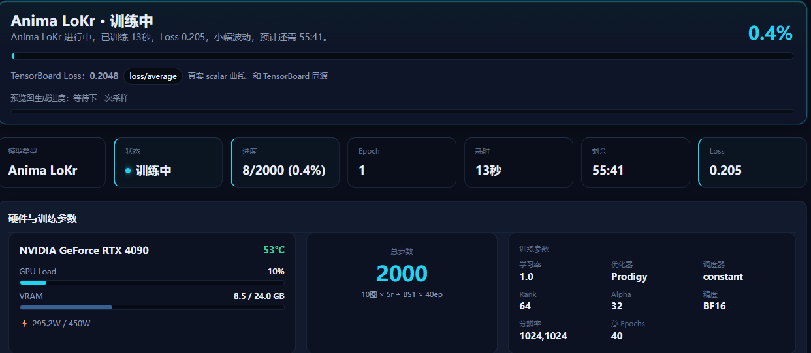
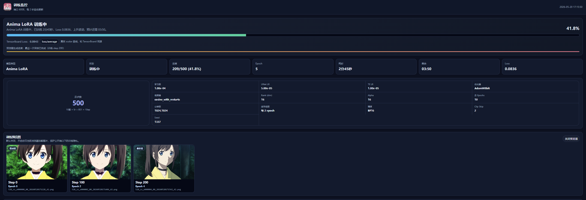
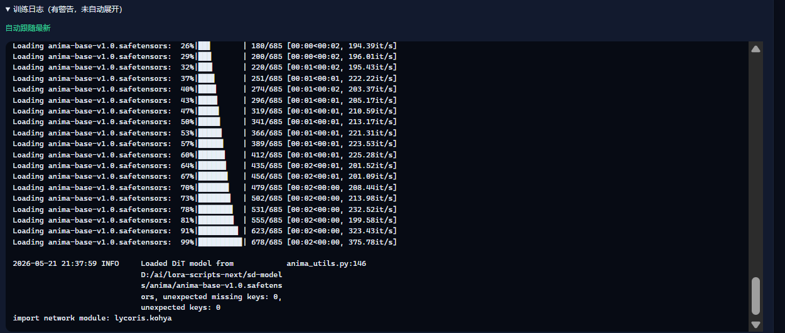

<p align="center">
  
</p>

<h1 align="center">Next Trainer</h1>

<p align="center">
  <b>One-click LoRA &amp; full finetune training GUI for Windows</b> — supports <b>Anima</b> / SD 1.5 / SDXL / Flux<br/>
  Extract and run. No environment setup needed. ~12 GB VRAM for Anima LoRA; <b>Anima full finetune needs ~24 GB</b>.<br/>
  <sub>Powered by <a href="https://github.com/kohya-ss/sd-scripts">kohya-ss/sd-scripts</a>, Akegarasu-style GUI.</sub>
</p>

<p align="center">
  <a href="https://github.com/wochenlong/lora-scripts-next/releases"></a>
</p>

<p align="center">
  <a href="https://github.com/wochenlong/lora-scripts-next"></a>
  <a href="https://github.com/wochenlong/lora-scripts-next/blob/main/LICENSE"></a>
</p>
<p align="center">
  <a href="https://github.com/wochenlong/lora-scripts-next/blob/main/README-zh.md"><b>中文</b></a>
</p>
<p align="center">
  <a href="https://github.com/wochenlong/lora-scripts-next/blob/main/NOTICE.md"><b>Credits</b></a>
</p>

---

<p align="center">
  
</p>

<p align="center"><sub>Home portal — quick links to training, monitor, and onboarding</sub></p>

---

## Get Started in 3 Steps

```
1. Download  →  SD-Trainer-v2.7.0.7z from [Releases](https://github.com/wochenlong/lora-scripts-next/releases), extract
2. Launch    →  Double-click run_gui.bat (auto-installs deps on first run, ~3 GB)
3. Train     →  Open http://127.0.0.1:28000, pick a model, set params, start training
```

The portable package ships the default WD tagger **wd14-convnextv2-v2** under **`tagger-models/wd14/`** (~400 MB). If Hugging Face download fails, place `model.onnx` and `selected_tags.csv` there manually — see [`docs/tagger-models.md`](docs/tagger-models.md).

> **CLI / cloud training:** `train.sh` is the legacy SD/SDXL/Flux entry. For Anima use the dedicated scripts:
> `bash train_anima_by_toml.sh docs/examples/anima-lora-benchmark-kohya.toml` (standard, non-Fast) or
> `bash train_anima_fast_by_toml.sh docs/examples/anima-lora-benchmark-fast.toml` (Fast plugin; run `bash scripts/cli/install_anima_fast.sh` first).

> **Requirements:** Windows 10/11, NVIDIA GPU (RTX 20+), ~7 GB disk.

<details>
<summary><b>Install from source (Linux / advanced users)</b></summary>

```sh
git clone https://github.com/wochenlong/lora-scripts-next.git
cd lora-scripts-next

# Windows
run_gui.bat

# Linux
bash install.bash && bash run_gui.sh

# Optional: install Flash Attention 2 for faster Anima training
# Windows
install_flash_attn.bat
# Linux
bash install_flash_attn.sh
```

Python **3.10** recommended. See [Flash Attention 2 docs](docs/flash-attention.md) for details.

</details>

---

## What's Supported

| Mode | Model / script | Notes |
|------|----------------|-------|
| **Anima LoRA** | LoRA · LoKr · **T-LoRA** | Flash Attention 2 / xformers / SDPA · from ~12 GB VRAM |
| **Anima LoRA Fast** | LoRA only (plugin) | Optional [anima_lora](https://github.com/sorryhyun/anima_lora) runtime · ~16 GB+ · see [`docs/anima-fast.md`](docs/anima-fast.md) |
| **Anima Finetune** | Full DiT (`anima_train.py`) | Sidebar **全量微调 → Anima Finetune** · **~24 GB VRAM** (4090-class) |
| SD 1.5 / SDXL LoRA | LoRA · LoHa · LoKr | xformers / SDPA |
| SD 1.5 / SDXL Finetune | Dreambooth / SDXL finetune | Sidebar **全量微调 → Stable Diffusion** |
| Flux | LoRA | xformers / SDPA |

<p align="center">
  
</p>

<p align="center"><sub>Anima LoRA — sidebar, model &amp; dataset form, config preview on the right</sub></p>

<p align="center">
  
</p>

<p align="center"><sub>Anima LoRA Fast — optional plugin path under <b>标准模式 / Fast 模式</b>; install runtime from the page before training</sub></p>

<p align="center">
  
</p>

<p align="center"><sub>Anima Finetune — full DiT weights under <b>全量微调</b> in the sidebar</sub></p>

---

## Train Monitor

Automatically opens a monitor page (port 6008) when training starts — GPU stats, training parameters, Loss curves, preview samples, and logs all in one dashboard.

<p align="center">
  
</p>

<p align="center"><sub>GPU load & VRAM, total steps, training params at a glance</sub></p>

<p align="center">
  
</p>

<p align="center"><sub>Preview samples and TensorBoard-backed Loss / LR curves</sub></p>

<p align="center">
  
</p>

<p align="center"><sub>Real-time training logs with auto-scroll</sub></p>

---

<details>
<summary><b>VRAM Reference (Anima, 1024 resolution, RTX 4090 benchmarked)</b></summary>

**Anima LoRA**

| VRAM | Configuration | Notes |
|------|---------------|-------|
| ≥ 24 GB | Default settings | Easiest |
| ≥ 16 GB | `gradient_checkpointing` | Recommended |
| ≥ 12 GB | Gradient checkpointing | Stable |
| ≥ 10 GB | Gradient checkpointing + `blocks_to_swap=16` | Slightly slower |
| ≥ 8 GB | Gradient checkpointing + swap 24 + cache TE + LoKr | Tight |

**Anima full finetune** (updates full DiT weights — use **Anima Finetune** in the WebUI, not LoRA)

| VRAM | Configuration | Notes |
|------|---------------|-------|
| ≥ 24 GB | Default + latents/TE cache | **~23–24 GB dedicated VRAM** in practice; 4090-class recommended |

</details>

<details>
<summary><b>Documentation</b></summary>

| Topic | Link |
|-------|------|
| Anima LoRA Training Guide | [docs/anima-training.md](docs/anima-training.md) |
| **Anima Fast Mode (optional plugin)** | [docs/anima-fast.md](docs/anima-fast.md) |
| Open-source notices | [NOTICE.md](NOTICE.md) |
| Anima backend (LoRA + full finetune) | [docs/anima-backend.md](docs/anima-backend.md) |
| Anima full finetune example TOML | [docs/examples/anima-full-finetune.toml](docs/examples/anima-full-finetune.toml) |
| Flash Attention 2 | [docs/flash-attention.md](docs/flash-attention.md) |
| Train Monitor & SSE API | [docs/train-monitor.md](docs/train-monitor.md) |
| Tagger model directory (`tagger-models/`) | [docs/tagger-models.md](docs/tagger-models.md) |
| Docker Deployment | [docs/docker.md](docs/docker.md) |
| CLI Arguments | [docs/cli-args.md](docs/cli-args.md) |

</details>

<details>
<summary><b>Changelog</b></summary>

| Date | Version |
|------|---------|
| 2026-05-28 | **v2.7.0** — **Anima LoRA Fast mode** (optional `anima_lora` plugin): WebUI entry, one-click install, train monitor sync, benchmark docs · see [`docs/anima-fast.md`](docs/anima-fast.md) |
| 2026-05-28 | **v2.6.0** — **Anima full finetune** WebUI (`anima-finetune`), `anima_train.py` wrapper, 全量微调 nav, train monitor label fix; ~24 GB VRAM reference |
| 2026-05-27 | **v2.5.3** — Portable dependency health check, sidebar version chip ([#54](https://github.com/wochenlong/lora-scripts-next/issues/54)) |
| 2026-05-21 | **v2.5.0** — UI refresh: new sidebar navigation, home portal page, training monitor dashboard with GPU metrics; CSS cleanup |
| 2026-05-21 | **v2.4.0** — Training stability: env isolation, NaN filter, sample guard, attn_mode fallback, path normalization; Portable tkinter fix |
| 2026-05-20 | **v2.3.0** — Train Monitor: TensorBoard-backed curves, parameter checks, log sync |
| 2026-05-19 | **v2.2.0** — Portable flash-attn fix, crash logging, cross-drive monitor |
| 2026-05-19 | **v2.1.0** — Flash Attention 2 prebuilt wheels, save-by-steps |
| 2026-05-18 | **v2.0.0** — First portable release, AMD detection, bf16 fix |

Full details in [CHANGELOG.md](CHANGELOG.md).

</details>

<details>
<summary><b>Credits</b></summary>

[Akegarasu/lora-scripts](https://github.com/Akegarasu/lora-scripts) · [kohya-ss/sd-scripts](https://github.com/kohya-ss/sd-scripts) · [LyCORIS](https://github.com/KohakuBlueleaf/LyCORIS) · [T-LoRA](https://github.com/ControlGenAI/T-LoRA) — Full attribution in [NOTICE.md](NOTICE.md)

</details>

---

<p align="center"><sub>Maintainer: <b><a href="https://github.com/wochenlong">@wochenlong</a></b> · <a href="CONTRIBUTORS.md">Contributors</a></sub></p>
