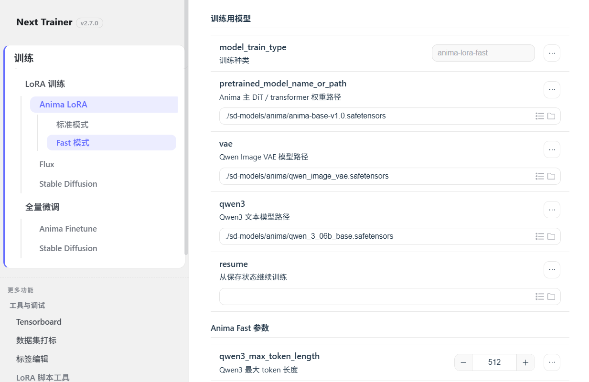

# Anima Fast 模式（进阶插件）

Anima Fast 是基于 [sorryhyun/anima_lora](https://github.com/sorryhyun/anima_lora)（**MIT License**）的**可选进阶插件**，通过独立 Python 环境与 `torch.compile` 加速 LoRA 训练。

与 **标准模式**（Kohya / `sd3-lora`）并列，入口在 WebUI：

**LoRA 训练 → Anima LoRA → Fast 模式**（`/lora/anima-fast.html`）



> 侧栏 **标准模式** 为 Kohya 路径（`/lora/sd3.html`）；**Fast 模式** 为本页。页顶含安装引导与 upstream 致谢。

> 维护者合并前清单：[`docs/anima-fast-merge-checklist.md`](./anima-fast-merge-checklist.md)

---

## 快速开始

1. 启动：`run_gui.bat` 或 `python gui.py`
2. 准备 Anima 三件套（[`anima-training.md`](./anima-training.md) 或根目录 `Download-Anima-Model.bat`）
3. 打开 **Anima LoRA → Fast 模式**，点击 **开启插件**，等待「插件已就绪」
4. 填写训练目录与参数，点击 **开始训练**；监控页 `/train-monitor` 显示 **Anima Fast LoRA**

---

## 何时选 Fast / 何时选标准模式

| 选 **标准模式**（`/lora/sd3.html`） | 选 **Fast 模式**（本页） |
|-----------------------------------|-------------------------|
| 需要 LoKr、T-LoRA 等 Kohya 网络 | **仅标准 LoRA**，追求训练吞吐 |
| 显存约 12GB，依赖 gradient checkpointing | **建议 16GB+**，可关闭部分省显存选项 |
| 开箱即用，无需额外安装 | 可接受首次 **数 GB** 插件环境下载 |
| Windows 主环境 PyTorch cu124 即可 | 需要 **CUDA 13** 插件 venv（cu130） |

**速度**：同数据集、同 LoRA 维度下，Fast 在本仓库 RTX 4090 实测约为标准模式的 **2.5×**（见下）；开启 UI 默认的 `torch_compile` 后通常更快。

---

## 性能对比（本仓库实测）

### 测试条件

| 项 | 值 |
|----|-----|
| 日期 | 2026-06-01 |
| GPU | **NVIDIA RTX 4090 24GB** |
| 数据集 | `data/train_data/10_subject`（10 张，caption `.txt`；Kohya 子目录命名示例） |
| 分辨率 | 1024×1024，enable bucket |
| LoRA | dim=16，alpha=16，`networks.lora_anima` |
| 优化器 | AdamW，lr=1e-4 |
| 批量 | 1，gradient_checkpointing=true |
| Cache | cache_latents / TE cache **均关闭**（冷启动公平对比） |
| 精度 | bf16 |

### 结果（20 step / 2 epoch 可比）

| 模式 | 后端 | Attention | torch.compile | 稳态 step 耗时 | 20 step 总耗时 | 相对标准模式 |
|------|------|-----------|---------------|----------------|----------------|--------------|
| **标准** | Kohya sd-scripts | sdpa* | — | **≈7.1 s/step** | **2分22秒** | 1× |
| **Fast** | anima_lora | flash | 关闭** | **≈2.8 s/step** | ≈56秒（按稳态估算） | **≈2.5×** |

\* 本机主 venv（cu124）上 Kohya 路径使用 `attn_mode=sdpa`；Flash Attention 需额外环境，与整合包默认一致。  
\** 本次 Fast 对标运行中 `torch_compile=false`；UI **默认 true**，编译预热后 step 时间通常更低。

### 参考：上游 anima_lora 公开数据

[sorryhyun/anima_lora README](https://github.com/sorryhyun/anima_lora) 在 **RTX 5060 Ti**、rank 32、1MP、full compile 场景报告 **≈1.1 s/step**、峰值显存约 13.4GB。与 Kohya 常规 **5–8 s/step** 量级相比约为 **5×**（硬件与 rank 不同，仅作上限参考）。

### 为什么 Fast 更快？

- **静态 token 形状**（bucket + padding 至 `static_token_count`）→ `torch.compile` 少重编译
- **按 block 或全模型 compile** +（可选）CUDAGraph → 降低 kernel 启动开销
- **独立 cu130 栈** + Flash Attention 4 等在 anima_lora 内深度适配

代价：**更高显存**、**仅 LoRA**、**需安装插件**、首次 compile **epoch 边界有秒级抖动**。

### 复现对标训练

配置文件（仓库内，可改路径后直接用）：

- 标准模式：[`docs/examples/anima-lora-benchmark-kohya.toml`](./examples/anima-lora-benchmark-kohya.toml)
- Fast 模式：[`docs/examples/anima-lora-benchmark-fast.toml`](./examples/anima-lora-benchmark-fast.toml)

```powershell
# 标准模式（主 venv，2 epoch = 20 step）
venv\Scripts\python.exe scripts\dev\anima_train_network.py `
  --config_file docs\examples\anima-lora-benchmark-kohya.toml

# Fast 模式（需先安装插件；2 epoch）
extensions\anima_lora\.venv\Scripts\python.exe extensions\anima_lora\source\train.py `
  --config_file docs\examples\anima-lora-benchmark-fast.toml
```

运行前请将 TOML 中的 `image_dir` / `source_image_dir` 改为你本地的训练数据路径。日志中查看 tqdm 行 `s/it` 即为每 step 耗时。

---

## 适用场景

| | 标准模式 | Fast 模式（插件） |
|---|---------|-------------------|
| 后端 | kohya sd-scripts | anima_lora 独立 runtime |
| 适配器 | LoRA / LoKr / T-LoRA 等 | **仅 LoRA** |
| 显存 | ~12GB+（可 checkpoint） | **建议 16GB+** |
| 速度 | 常规（本测 ≈7 s/step） | **更快**（本测 ≈2.8 s/step 起） |
| 安装 | 开箱即用 | **需先开启插件** |

---

## 前置条件

- NVIDIA GPU，驱动支持 **CUDA 13** 相关轮子（见 `config/anima_fast_environment/`）
- 建议 **16GB+** 显存
- 已准备 Anima 三件套（见 [anima-training.md](./anima-training.md) 或根目录 `Download-Anima-Model.bat`）
- 稳定网络（首次安装插件会下载 **数 GB** 依赖到 `extensions/anima_lora/.venv/`）

---

## 安装插件（WebUI）

1. 启动 SD Trainer：`run_gui.bat` 或 `python gui.py`
2. 打开 **Anima LoRA → Fast 模式**
3. 阅读页顶说明；状态为 **「进阶插件 · 待开启」** 时，训练按钮为灰色（正常）
4. 点击 **「开启插件」**，确认对话框后等待安装与审计完成
5. 状态变为 **「插件已就绪」** 后即可训练

安装日志在页面下方；也可通过 API 查看：

```http
GET /api/plugins/anima-lora/status
```

维护者紧急关闭（一般用户无需设置）：

```powershell
$env:LORA_ENABLE_ANIMA_FAST = "0"   # 禁止安装与训练，UI 仍可见
python gui.py
```

---

## 前端训练

1. 在 Fast 模式页填写参数（与标准 Anima LoRA 部分字段不同，含 `torch_compile`、`static_token_count` 等）
2. 打开 **「启用训练预览图」** 可在训练过程中定期出图（写入 `output_dir/sample/`，训练监控页 `/train-monitor` 可查看）
3. 插件 **已就绪** 后点击 **「开始训练」**
4. 训练日志：`/train-log?task_id=...`；监控页 `/train-monitor` 会识别 `Anima Fast LoRA`

预览图会加载 VAE 与 Qwen3 做推理，**显存与时间开销明显高于纯训练**；16GB 卡若已开 `torch_compile`，建议降低预览频率或分辨率。

未安装插件时点击训练，API 会返回类似：

```text
Anima Fast extension is not ready. Install or repair the extension first.
```

---

## 命令行 / API 训练

### 1. 检查插件状态

```powershell
curl http://127.0.0.1:28000/api/plugins/anima-lora/status
```

### 2. 安装插件（API，等同页内「开启插件」）

```powershell
curl -X POST http://127.0.0.1:28000/api/plugins/anima-lora/install `
  -H "Content-Type: application/json" `
  -d "{\"dry_run\": false}"
```

### 3. 预检查配置（不启动训练）

```powershell
curl -X POST http://127.0.0.1:28000/api/plugins/anima-lora/preflight `
  -H "Content-Type: application/json" `
  -d @your-fast-config.json
```

### 4. 生成 TOML（dry-run）

```powershell
curl -X POST http://127.0.0.1:28000/api/plugins/anima-lora/dry-run `
  -H "Content-Type: application/json" `
  -d "{\"model_train_type\":\"anima-lora-fast\", \"train_data_dir\":\"./train/data\", ...}"
```

返回的 `toml_path` 位于 `config/autosave/`。

### 5. 提交训练（与前端「开始训练」相同）

向 `/api/run` POST JSON，`model_train_type` 必须为 `anima-lora-fast`：

```powershell
curl -X POST http://127.0.0.1:28000/api/run `
  -H "Content-Type: application/json" `
  -d "{\"model_train_type\":\"anima-lora-fast\", ...}"
```

插件未就绪时会被拒绝；就绪后由 `mikazuki.process.run_anima_fast_train` 调用：

```text
extensions/anima_lora/.venv/Scripts/python.exe  <anima_root>/train.py  --config_file  <autosave.toml>
```

### 6. 开发者：已有本地 anima_lora 克隆

```powershell
$env:LORA_ANIMA_FAST_DEV_MODE = "1"
# 可选：$env:ANIMA_LORA_ROOT = "D:\path\to\anima_lora"
```

并在 `config/anima_fast_backend.toml` 中配置 `external_root` / `external_python`。

---

## 目录与输出

| 路径 | 说明 |
|------|------|
| `extensions/anima_lora/source/` | 插件源码快照 |
| `extensions/anima_lora/.venv/` | Fast 独立 Python 环境 |
| `output/anima_fast/` | 默认 LoRA 输出 |
| `logs/anima_fast/` | 日志与 `*.progress.jsonl` |
| `.cache/anima_fast/` | 预处理 cache |

---

## 优化器依赖

Fast 页与标准 Kohya 页共用 **LR_OPTIMIZER** 选项（默认 `AdamW8bit`）。插件独立 venv 会安装以下包（见 `config/anima_fast_environment/anima-constraints-cu130.txt`）：

| 优化器示例 | 依赖包 |
|-----------|--------|
| `AdamW8bit`、`PagedAdamW8bit`、`Lion8bit` 等 8bit | `bitsandbytes` |
| **Automagic** | `optimum-quanto` |
| `Lion` | `lion-pytorch` |
| `Prodigy` | `prodigyopt` |
| `DAdaptation` / `DAdaptAdam` 等 | `dadaptation` |
| `RAdamScheduleFree` 等 | `schedulefree` |
| `pytorch_optimizer.CAME` 等 | `pytorch-optimizer` |
| `AdamW` | 无额外依赖（PyTorch 内置） |

Fast 页优化器下拉**仅列出 anima_lora 已支持的选项**（不含 `prodigyplus.*` 等 Kohya 专用项）。Automagic 建议起始 `learning_rate=1e-6`。

若报错 `ImportError: No bitsandbytes` 或 `libbitsandbytes_cuda130.dll not found`，说明插件是在补全优化器依赖前安装的，或 `bitsandbytes` 版本过旧（cu130 需 **≥ 0.49**）：在 Fast 页点击 **「修复插件」**（或 `POST /api/plugins/anima-lora/repair`）重新同步依赖。

---

## 故障排除

| 现象 | 处理 |
|------|------|
| 状态「进阶插件 · 待开启」 | 点击「开启插件」完成安装 |
| 安装失败 / 审计失败 | 页内日志；或 `POST /api/plugins/anima-lora/repair` |
| `No bitsandbytes` / 优化器 ImportError | 修复插件；或确认 `optimizer_type=AdamW` 临时绕过 |
| 末 epoch 报 accelerate / `NoneType is not iterable` | torch 的 `.dist-info` 损坏；**修复插件** 或重装 `torch==2.11.0+cu130` |
| 训练按钮灰色 | 插件未就绪；先安装 |
| CUDA / 显存报错 | 改用标准模式，或降低分辨率 / batch |
| 维护者禁用 | 环境变量 `LORA_ENABLE_ANIMA_FAST=0` |

更多架构说明见本地规划文档 `doc/双模式Turbo集成计划.md`（不上传 GitHub）。

---

## 致谢

Fast 模式训练引擎基于开源项目 [sorryhyun/anima_lora](https://github.com/sorryhyun/anima_lora)。感谢原作者与社区的开发与分享；SD Trainer 以可选插件形式集成，各组件遵循其各自的开源许可。

## 开源许可

| 组件 | 许可证 | 说明 |
|------|--------|------|
| **lora-scripts-next**（本仓库 GUI/集成） | AGPL-3.0 | 见根目录 `LICENSE` |
| **sorryhyun/anima_lora**（Fast 训练引擎） | **MIT** | 插件安装时复制至 `extensions/anima_lora/source/LICENSE` |
| **kohya-ss/sd-scripts**（标准 Anima LoRA） | Apache-2.0 等 | 见 `vendor/sd-scripts/LICENSE.md` |

MIT 与 AGPL 兼容：Fast 插件以**独立可选组件**分发，不修改上游 MIT 许可文本。完整第三方列表见根目录 [`NOTICE.md`](../NOTICE.md)。

在 Fast 模式页面顶部的致谢条中亦指向 upstream 仓库。
